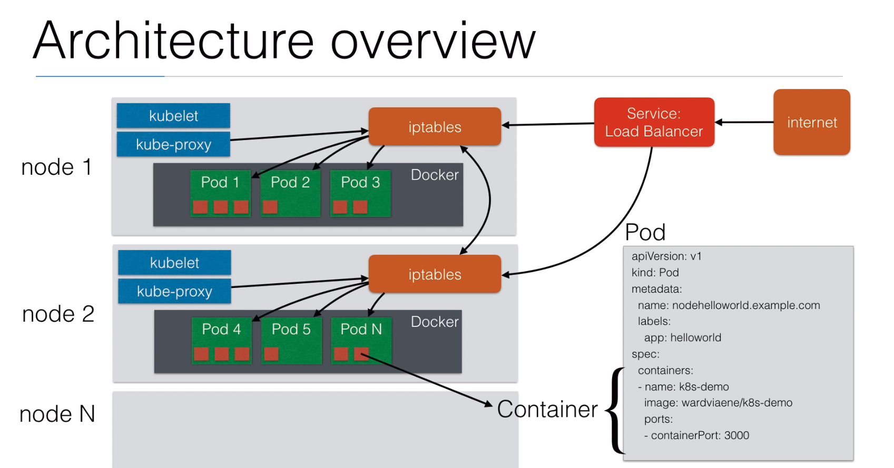

# High Level Architecture Overview

Each **Node** consists of N number of **Pods**, this can be zero pods, or multiple pods.

Each **Pod** consists of N number of **Containers**, this can be zero containers, or multiple containers.

**Pods** run on top of **Docker**, or another containerisation platform of your choice.

Each **Node** contains a **kubelet** and a **kube-proxy**, as well as **IPtables**.
  - The **kubelet** launches and manages pods (it connects to the Master Node to get information on what it should be running)
  - The **kube-proxy** Feeds info of pods on the node to IPtables.
  - **IPtables** on the node routes traffic to the pods and containers. It an also talk directly to IPtables on other nodes in the cluster in order to forward traffic to pods on other nodes

**Services** run outside of the **Nodes**. An example of a **Service** is a **Load Balancer**.
  - The **Load Balancer** is publicly available and forwards traffic from the internet to the cluster. It has the clusters **nodes** listed and forwards traffic to **IPtables**.

## Pods

Containers within a **Pod** can easily communicate with each other using a shared network and always run in a shared context. They are always co-located and co-scheduled. The containers in a **Pod** are tightly coupled and act as though they are on the same machine, therefore can access each other using `localhost`:`port` and also share storage if any is defined for the **Pod**.
